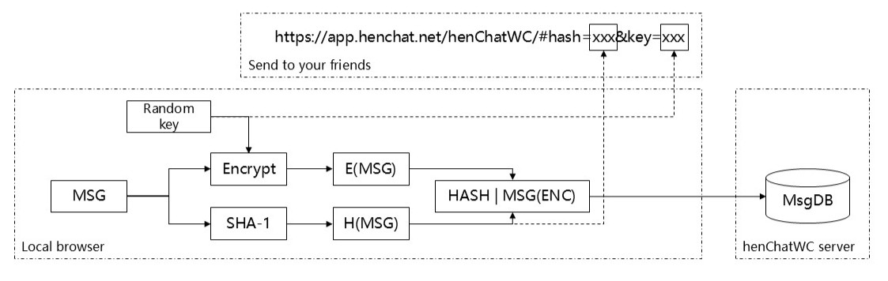

# henChatWC

## What's this

A branch of henChat, act as a helper of WeChat, or any other IMs whose experiences are like you are chatting with your friends in WC. 
I know you are lazy, so I made this. No need to create any accounts, just input your message, and send the generated URL+token to your friends by any IMs.

## How it works

### For sender

Shown in image. You can see that the server only knows the encrypted message MSG(ENC) and the message hash HASH, as well as outdate time (not shown in image). An URL contains HASH and KEY will be generated. You can send it to anyone else. 
BTW, in order to be avoid of overlapping of HASH that generated by same message, all messages used for generating HASHs are appended with random salt. 

### For receiver

Receiver should access the URL to fetch the message by HASH. Decryption will also be done locally. 

## Deployment

So easy. For server, run `python3 hcwServer.py <host>:<port> <db_path>` on any OSs equipped with Python 3.7+, and extra libraries are not required. 
For client, see [henChatWC-WebUI](https://github.com/CH3COOOH/henChatWC-WebUI). 
